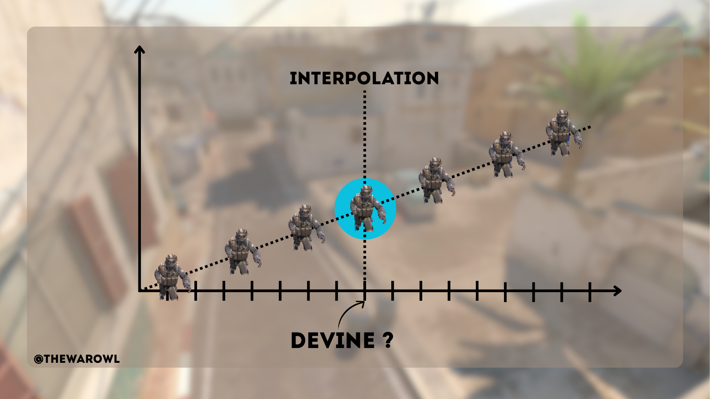

# Timeline de l'intervention : Talk Show Counter-Strike

## 1. Introduction
- Présentation rapide.
- Introduction au sujet : les serveurs 64-ticks vs 128-ticks dans Counter-Strike.

## 2. Explication des serveurs 64-ticks
- Définition et fonctionnement.
- Avantages et inconvénients.

## 3. Explication des serveurs 128-ticks
- Définition et fonctionnement.
- Comparaison avec les serveurs 64-ticks.

- `interpolation`

- Commande `cl_interp` et pourquoi Valve l’a supprimée (elle permettait de changer la valeur côté client, mais pas assez fair pour tout le monde, car tout le monde n’a pas un super ordi ET une superbe connexion).
- **Coûts associés** : charge en bande passante et en processeur (128 fois par seconde au lieu de 64).
- Raisons techniques pour lesquelles Valve ne les a jamais adoptés officiellement (contrairement à FACEIT, ESEA, etc.).

## 5. Présentation de la technologie subtick dans Source 2, pourquoi c'est génial et nul à la fois ?

- Qu’est-ce que le moteur Source 2 ?
- Introduction du **"sub-tick system"** dans CS2 et ses promesses : meilleure réactivité, hit registration, etc.
- `timestamp`

- "Picker Advantage", le timing entre quand tu "peek" et quand l’ennemi voit ce peek.

## 6. Conclusion
- Doubler les coûts pour résoudre un problème technique n’est pas élégant, mais ça résout les soucis.
- Compromis ?
- Récapitulatif des points clés.
- Session de questions/réponses (si possible).

---

Source:
- [Valve Subtick Video](https://youtu.be/GqhhFl5zgA0)
- [TheWarOwl, Subtick vs Tickrate](https://youtu.be/aWtPpry5UPg?t)
